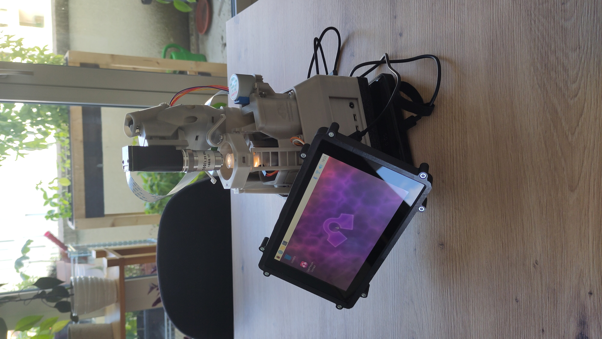
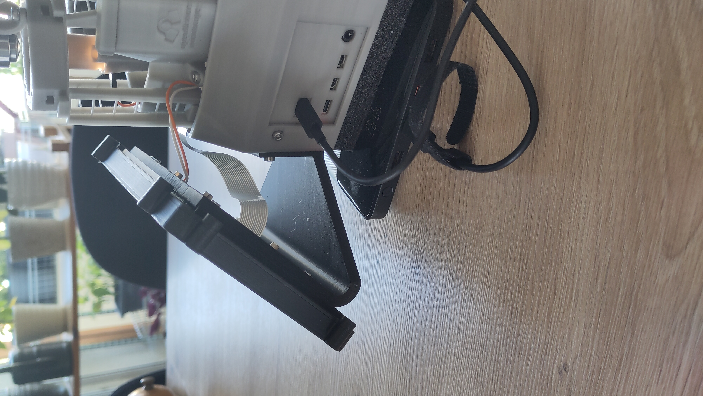

# Openflexure_screen_mount
3D-printed screen mount to mount an official Raspberry Pi Touch Display on an Openflexure microscope v7. This is based on the design of https://github.com/WOIDMO/Mini-hematology-lab/tree/main, but has been modified to avoid reprinting the entire microscope base.

Images :
)

